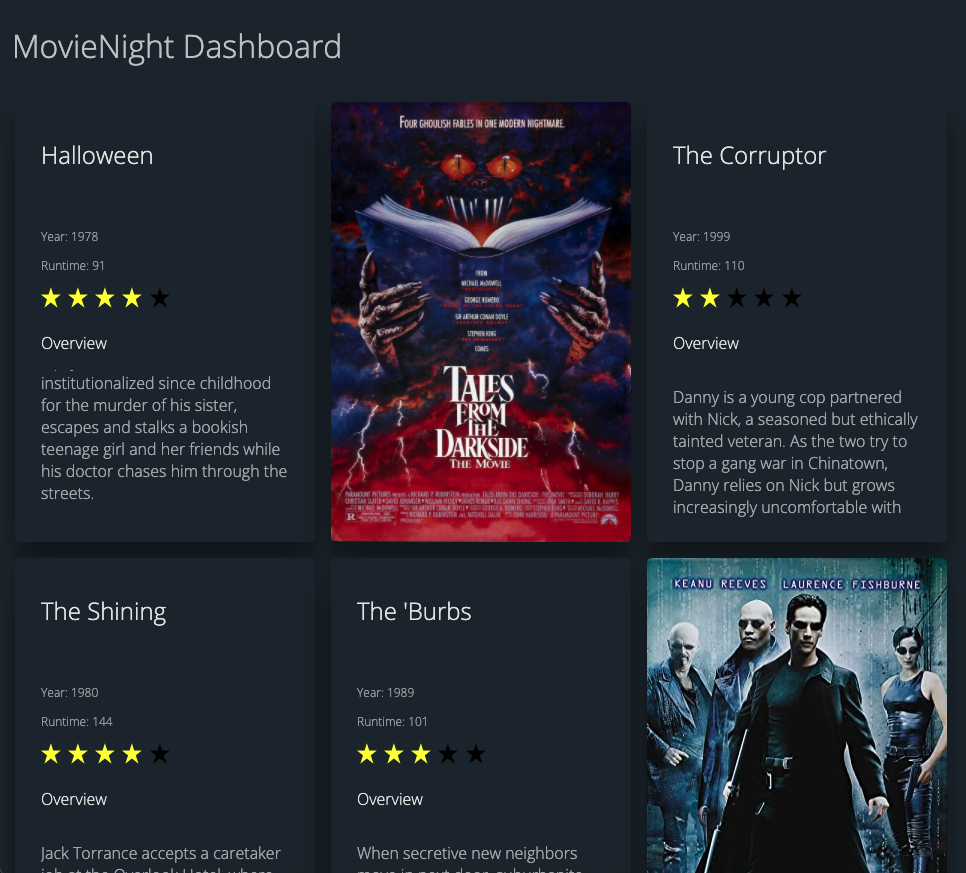
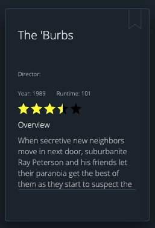

# Movie Night App (In Progress)

**Movie Database.**

Tired of wasting time flicking through Netflix's and Primes ? MovieNight will help you find your next movie by generating a top 10 list from from films you haven't seen before. Movie Night is a quick and simple solution to solve this problem, once the user has there own account they will be able to click a recommendation button that will recommend a movie that matches there liking.

* **30,000+ Movie Database** - MovieNight has a database with 30,000+ titles to explore through.

**Task Completion List**
* **Build Movie Database** - 30,000+ titles
* **Build an API** - 

## Requirements

Python 3.8.5+, pipenv

## Instalation

First, clone this repository.

    $ git clone http://github.com/karlduggan/MovieNightApp
    $ cd MovieNightApp

After, install all necessary to run:

    $ pipenv install

Than, run the application:

  $ pipenv run python run.py

To see your application, access this url in your browser: 

  http://localhost:5000
  
## Progress Entries

31/03/2021 - Flip cards added along with 5 star rating component 
 

 
03/04/2021 - Update to flip cards along with 5 star and half star rating component.
Added:
*  Bookmark (to the top right corner) - not connected yet to a system
*  Border around back of card
*  Director (no data for that yet)
*  Year and runtime inline 
*  Overview text scrollable 
*  Overlay (front of card) dims when hover   
 

 
